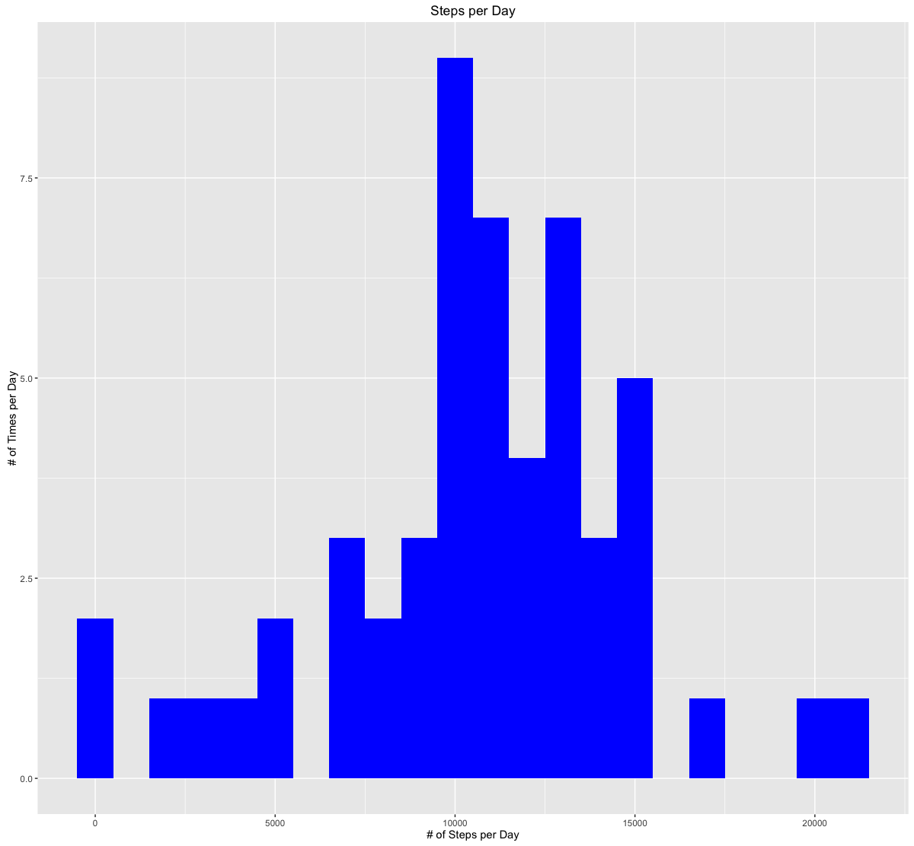

## Loading and preprocessing the data

```r
library(lattice)
library(ggplot2)

dataset <- read.csv("activity.csv")
dataset_clean <- read.csv("activity.csv")

dataset_clean$date <- as.POSIXct(dataset_clean$date, format="%Y-%m-%d")

# Compute the weekdays from the date attribute
dataset_clean <- data.frame(date=dataset_clean$date, 
                           weekday=tolower(weekdays(dataset_clean$date)), 
                           steps=dataset_clean$steps, 
                           interval=dataset_clean$interval)

# Compute the day type (weekend or weekday)
dataset_clean <- cbind(dataset_clean, 
                      daytype=ifelse(dataset_clean$weekday == "saturday" | 
                                     dataset_clean$weekday == "sunday", "weekend", 
                                     "weekday"))

# Create the final data frame
dataset_clean <- data.frame(date=dataset_clean$date, 
                       weekday=dataset_clean$weekday, 
                       daytype=dataset_clean$daytype, 
                       interval=dataset_clean$interval,
                       steps=dataset_clean$steps)
```


## What is mean total number of steps taken per day?

```r
StepsPerDay <- aggregate(steps ~ date, dataset, sum)
colnames(StepsPerDay) <- c("date","steps")

ggplot(StepsPerDay, aes(x = steps)) + 
      geom_histogram(fill = "Blue", binwidth = 1000) + 
            labs(title="Steps per Day", 
                  x = "# of Steps per Day", y = "Number of times in a day(Count)")
```



```r
Mean_Steps   <- mean(StepsPerDay$steps, na.rm=TRUE)
Median_Steps <- median(StepsPerDay$steps, na.rm=TRUE)
```

## What is the average daily activity pattern?

```r
DailyActivity <- aggregate(dataset$steps, by = list(interval = dataset$interval),
                  FUN=mean, na.rm=TRUE)

DailyActivity$interval <- 
        as.integer(levels(DailyActivity$interval)[DailyActivity$interval])
```

```r
colnames(DailyActivity) <- c("interval", "steps")

ggplot(DailyActivity, aes(x=interval, y=steps)) +   
        geom_line(color="red", size=0.75) +  
        labs(title="Avg Daily Activity Pattern", x="Interval", y="# of Steps")
```


## Inputing missing values

```r
na_fill <- function(data, pervalue) {
        na_index <- which(is.na(data$steps))
        na_replace <- unlist(lapply(na_index, FUN=function(idx){
                interval = data[idx,]$interval
                pervalue[pervalue$interval == interval,]$steps
        }))
        fill_steps <- data$steps
        fill_steps[na_index] <- na_replace
        fill_steps
}

dataset_fill <- data.frame(  
        steps = na_fill(dataset, DailyActivity),  
        date = dataset$date,  
        interval = dataset$interval)
str(dataset_fill)
```

```
## 'data.frame':	17568 obs. of  3 variables:
##  $ steps   : num  1.717 0.3396 0.1321 0.1509 0.0755 ...
##  $ date    : Factor w/ 61 levels "2012-10-01","2012-10-02",..: 1 1 1 1 1 1 1 1 1 1 ...
##  $ interval: int  0 5 10 15 20 25 30 35 40 45 ...
```

```r
fill_StepsPerDay <- aggregate(steps ~ date, dataset_fill, sum)
colnames(fill_StepsPerDay) <- c("date","steps")

##plotting the histogram
ggplot(fill_StepsPerDay, aes(x = steps)) + 
       geom_histogram(fill = "green", binwidth = 1000) + 
        labs(title="Steps Taken per Day", 
             x = "# of Steps per Day", y = "# of times in a day(Count)")
```


## Are there differences in activity patterns between weekdays and weekends?

```r
Activity <- data.frame(date=StepsPerDay$date, 
                       weekday=StepsPerDay$weekday, 
                       daytype=StepsPerDay$daytype, 
                       interval=StepsPerDay$interval,
                       steps=StepsPerDay$steps)
```

```
## Error in data.frame(date = StepsPerDay$date, weekday = StepsPerDay$weekday, : arguments imply differing number of rows: 53, 0
```

```r
# Compute the average number of steps taken, averaged across all daytype variable
mean_data <- aggregate(dataset_clean$steps, 
                       by=list(dataset_clean$daytype, 
                               dataset_clean$weekday, dataset_clean$interval), mean, na.rm = TRUE)

names(mean_data) <- c("daytype", "weekday", "interval", "mean")

xyplot(mean ~ interval | daytype, mean_data, 
       type="l", 
       lwd=1, 
       xlab="Interval", 
       ylab="Number of steps", 
       layout=c(1,2))
```


